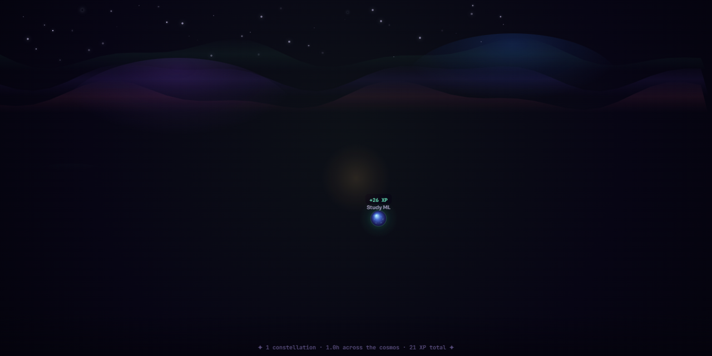

# 🌱 Claude Quest — Tuesday, April 14, 2026

<div align="center">




   

</div>

> 🌱 **Novice** &nbsp;·&nbsp; ⚡ **21 XP** &nbsp;·&nbsp; 🏕️ **Lonely Hamlet** &nbsp;·&nbsp; 🔥 **0 day streak**

---

## ⚡ Today at a Glance

| Metric | Value | Detail |
|:-------|:-----:|:-------|
| 🎯 Tasks Completed | **1** | 1 session focused |
| ⏱️ Total Hours | **1.0h** | Light session — keep going! |
| ⚡ XP Earned | **21 XP** | 79 XP to Apprentice |
| 📊 Level Progress | **21%** | ███░░░░░░░░░░░░░ |
| 🔥 Streak | **0 days** | Start a streak today! |
| ☀️ Wake Time | **08:00** | Late start — target before 8am |
| 🌙 Sleep Time | **22:15** | Sleep target: before 10:30pm |
| 😴 Est. Sleep | **9.8h** | Great sleep duration — optimal for cognitive performance. |

## 📝 Task Breakdown

| # | Task | Category | Duration | Difficulty | XP | Files |
|:-:|:-----|:--------:|:--------:|:----------:|---:|:-----:|
| 1 | **Study ML** | 📚 learning | 1h | ⚡ warmup | **+26 XP** | — |

<details>
<summary>📌 <strong>Session Notes</strong> (1)</summary>

**Study ML** *(1h)*

> I studied for tomorrow exam . lets see how it goes

</details>

## 📊 XP Distribution Chart

```text
Task XP Breakdown (today)
──────────────────────────────────────────
Study ML           ██████████████████   +26 XP
──────────────────────────────────────────
TOTAL              ████░░░░░░░░░░░░░░   +21 XP
```

```text
Hours per Task
──────────────────────────────────────
Study ML           ██████████████    1h
──────────────────────────────────────
Total                              1.0h
```

## 🕒 XP Timeline

| Time | Event | XP |
|:-----|:------|---:|
| `10:13 PM` | Wake: Late start — after 8am | `-15` |
| `10:13 PM` | Sleep: On time! Before 10:30pm | `+10` |
| `10:14 PM` | Completed: Study ML (1h) | `+26` |

## 🏆 Insights

- Log more tasks and maintain your streak to unlock insights!

## 🏅 Badge Wall (5 / 199 unlocked)

- 🐙 **Commit Pusher** *(rare)* — Sync your data to GitHub
- 📊 **Analyst** *(common)* — Generate a daily report
- 🔒 **Locked In** *(common)* — Log 1+ hour in a single task
- ⚔️ **First Blood** *(common)* — Complete your first task
- 😴 **Sleep King** *(rare)* — Log both wake and sleep same day

---

<div align="center">

*Generated by **Claude Quest ** · 2026-04-14T16:50:50.088Z*

*Rank: **🌱 Novice** · Cosmos: **🏕️ Lonely Hamlet** · Streak: **🔥 0d** · Badges: **🏅 5/199***

[⬅️ April 2026](../README.md) &nbsp;·&nbsp; [🏠 2026 Overview](../../README.md)

</div>
