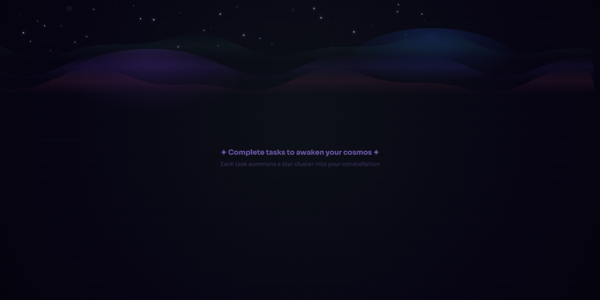
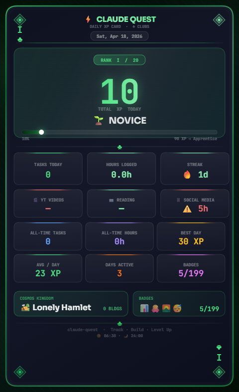

# 🌱 Claude Quest — Saturday, April 18, 2026

<div align="center">





   

</div>

> 🌱 **Novice** &nbsp;·&nbsp; ⚡ **10 XP** &nbsp;·&nbsp; 🏕️ **Lonely Hamlet** &nbsp;·&nbsp; 🔥 **1 day streak**

---

## ⚡ Today at a Glance

| Metric | Value | Detail |
|:-------|:-----:|:-------|
| 🎯 Tasks Completed | **0** | No tasks logged yet |
| ⏱️ Total Hours | **0.0h** | Nothing logged |
| ⚡ XP Earned | **10 XP** | 30 XP to Apprentice |
| 📊 Level Progress | **71%** | ███████████░░░░░ |
| 🔥 Streak | **1 days** | Building momentum |
| ☀️ Wake Time | **06:30** | Early riser bonus earned! |
| 🌙 Sleep Time | **24:00** | Sleep target: before 10:30pm |
| 😴 Est. Sleep | **6.5h** | Adequate sleep, but aiming for 7–8h could boost XP gains. |
| 📱 Social Media | **5h** | 🚨 Aim to reduce |

## 🕒 XP Timeline

| Time | Event | XP |
|:-----|:------|---:|
| `11:51 PM` | Wake: Amazing! Before 7am | `+20` |
| `11:51 PM` | Sleep: Night owl — after 10:30pm | `-10` |

## 📈 Historical Context

| Metric | Value |
|:-------|------:|
| Days tracked | 2 |
| Average daily XP | 30 |
| Best day | 2026-04-15 (30 XP) |
| Today vs average | ⬇️ Below average (-20) |

### Last 2 Days

```text
2026-04-15  ██████████████    30 XP
2026-04-16  ██████████████    30 XP
2026-04-18  █████░░░░░░░░░    10 XP ← today
```

## 🏆 Insights

- Log more tasks and maintain your streak to unlock insights!

## 📱 Social Media Usage

> 🚨 Very high usage — time to act  Total today: **5h** *(5.0h)*

| # | Hours | Platforms | Reason | Time |
|:-:|:-----:|:----------|:-------|:----:|
| 1 | 5h | other | boredom, habit, entertainment, procrastination | 11:52 PM |

**Reduction Strategies Committed To:** `app-limits`

**My Commitment:**

> "I am not going to use any social media tomorrow"

## 🌙 Tomorrow's Plan

> ⏰ **Wake up target:** 06:50
> 🎯 **Focus theme:** deep

**Priority Queue:**

🥇 Wake up 6:30 to 7 am

**Notes:**

> *I will remove social media and goo fully focussed*

## 🌱 Life Tracker

### 🔑 Daily Habits

| Habit | Status |
|:------|:------:|
| 💧 Hydration (8 glasses) | ✅ Done |
| 🏃 Exercise | ⬜ Not done |
| 📚 Reading 20+ min | ⬜ Not done |
| 📝 Journal | ⬜ Not done |
| 🧘 Meditate | ⬜ Not done |

*Completed: **1/5** habits today*

### 😴 Sleep Quality

| Rating | Label | Bar |
|:------:|:------|:----|
| **6/10** | Decent 😐 | `██████░░░░` |

### 🌿 Aloe Vera Care

| Applied Today | Proof Uploaded | XP Bonus |
|:-------------:|:--------------:|:--------:|
| ✅ Yes | — | — |

> 🌿 Aloe streak: **1 days** · This month: **1 times** · This year: **1 times**

## 🏅 Badge Wall (5 / 199 unlocked)

- 😴 **Sleep King** *(rare)* — Log both wake and sleep same day
- 🌄 **Dawn Patrol** *(rare)* — Wake before 5am
- 🐙 **Commit Pusher** *(rare)* — Sync your data to GitHub
- 📊 **Analyst** *(common)* — Generate a daily report
- 🌅 **Early Bird** *(common)* — Wake before 6am

---

<div align="center">

*Generated by **Claude Quest ** · 2026-04-18T18:28:04.348Z*

*Rank: **🌱 Novice** · Cosmos: **🏕️ Lonely Hamlet** · Streak: **🔥 1d** · Badges: **🏅 5/199***

[⬅️ April 2026](../README.md) &nbsp;·&nbsp; [🏠 2026 Overview](../../README.md)

</div>
