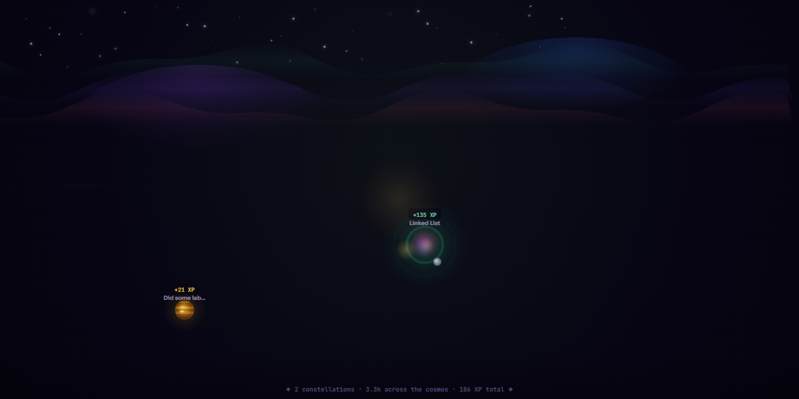
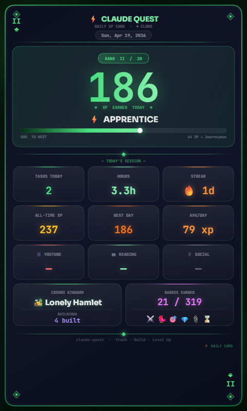

# ⚡ Claude Quest — Sunday, April 19, 2026

<div align="center">





   

</div>

> ⚡ **Apprentice** &nbsp;·&nbsp; ⚡ **186 XP** &nbsp;·&nbsp; 🏕️ **Lonely Hamlet** &nbsp;·&nbsp; 🔥 **1 day streak**

---

## ⚡ Today at a Glance

| Metric | Value | Detail |
|:-------|:-----:|:-------|
| 🎯 Tasks Completed | **2** | 2 focused sessions |
| ⏱️ Total Hours | **3.3h** | Solid work session |
| ⚡ XP Earned | **186 XP** | 13 XP to Journeyman |
| 📊 Level Progress | **92%** | ███████████████░ |
| 🔥 Streak | **1 days** | Building momentum |
| ☀️ Wake Time | **06:45** | Early riser bonus earned! |
| 🌙 Sleep Time | **23:00** | Sleep target: before 10:30pm |
| 😴 Est. Sleep | **7.8h** | Great sleep duration — optimal for cognitive performance. |
| 📱 Social Media | **5h** | 🚨 Aim to reduce |

## 📝 Task Breakdown

| # | Task | Category | Duration | Difficulty | XP | Files |
|:-:|:-----|:--------:|:--------:|:----------:|---:|:-----:|
| 1 | **Linked List** | 📚 learning | 2.75h | 🔥 deepwork | **+135 XP** | 📎 Yes |
| 2 | **Did some lab work of Mobile application development** | ✍️ writing | 0.5h | ⚡ warmup | **+21 XP** | 📎 Yes |

<details>
<summary>📌 <strong>Session Notes</strong> (2)</summary>

**Linked List** *(2.75h)*

> I learned about linked list and its usage

**Did some lab work of Mobile application development** *(0.5h)*

> I learned about linked list and its usage

</details>

## 📊 XP Distribution Chart

```text
Task XP Breakdown (today)
──────────────────────────────────────────
Linked List        ██████████████████  +135 XP
Did some lab wor…  ███░░░░░░░░░░░░░░░   +21 XP
──────────────────────────────────────────
TOTAL              ██████████████████  +186 XP
```

```text
Hours per Task
──────────────────────────────────────
Linked List        ██████████████ 2.75h
Did some lab wor…  ███░░░░░░░░░░░  0.5h
──────────────────────────────────────
Total                              3.3h
```

## 🗂️ Category Breakdown

| Category | Tasks | Hours | XP Earned | Avg XP/task |
|:---------|------:|------:|----------:|------------:|
| 📚 learning | 1 | 2.8h | 135 XP | 135 XP |
| ✍️ writing | 1 | 0.5h | 21 XP | 21 XP |

## 🕒 XP Timeline

| Time | Event | XP |
|:-----|:------|---:|
| `10:43 PM` | Completed: Linked List (2.75h + proof) | `+135` |
| `10:44 PM` | Sleep: Night owl — after 10:30pm | `-10` |
| `10:44 PM` | Wake: Amazing! Before 7am | `+20` |
| `10:45 PM` | Completed: Did some lab work of Mobile application development (0.5h + proof) | `+21` |
| `10:49 PM` | Challenge: Reflective | `+20` |

## 📈 Historical Context

| Metric | Value |
|:-------|------:|
| Days tracked | 2 |
| Average daily XP | 26 |
| Best day | 2026-04-17 (30 XP) |
| Today vs average | ✅ Above average (+160) |

### Last 2 Days

```text
2026-04-14  ██░░░░░░░░░░░░    21 XP
2026-04-17  ██░░░░░░░░░░░░    30 XP
2026-04-19  ██████████████   186 XP ← today
```

## 🏆 Insights

- 📎 **Proof provided** — file attachments earned a 50% XP bonus on qualifying tasks.

## 📱 Social Media Usage

> 🚨 Very high usage — time to act  Total today: **5h** *(5.0h)*

| # | Hours | Platforms | Reason | Time |
|:-:|:-----:|:----------|:-------|:----:|
| 1 | 5h | — | boredom, procrastination, habit, entertainment | 10:50 PM |

**Reduction Strategies Committed To:** `delete-app`, `replace`

**My Commitment:**

> "I am commited to remove this from my part of life"

## 🌙 Tomorrow's Plan

> ⏰ **Wake up target:** 05:25
> 🎯 **Focus theme:** deep

**Priority Queue:**

🥇 waking up early say before 5:30 am
🥈 Complete work in lab and 30 minutes of reading topics of college
🥉 Read a book first

**Notes:**

> *MY  intention would be write the task i do today and remove the waste time i do*

## 🌱 Life Tracker

### 🔑 Daily Habits

| Habit | Status |
|:------|:------:|
| 💧 Hydration (8 glasses) | ✅ Done |
| 🏃 Exercise | ⬜ Not done |
| 📚 Reading 20+ min | ⬜ Not done |
| 📝 Journal | ⬜ Not done |
| 🧘 Meditate | ⬜ Not done |
| 📬 Check Mail | ⬜ Not checked |

*Completed: **1/5** habits today · Mail: **⬜***

### 😴 Sleep Quality

| Rating | Label | Bar |
|:------:|:------|:----|
| **6/10** | Decent 😐 | `██████░░░░` |

### 🌿 Aloe Vera Care

| Applied Today | Proof Uploaded | XP Bonus |
|:-------------:|:--------------:|:--------:|
| ✅ Yes | — | — |

> 🌿 Aloe streak: **1 days** · This month: **1 times** · This year: **1 times**

## ⚔️ Challenges Completed Today

- ✅ **Reflective** — +20 XP

## 🏅 Badge Wall (21 / 319 unlocked)

- ⌛ **3-Hour Day** *(common)* — Log 3+ hours in a single day
- 📎 **Show Your Work** *(common)* — Upload proof for 1 task
- 💎 **Super Efficient** *(rare)* — Average 50+ XP per task today
- 🎯 **Efficient** *(common)* — Average 20+ XP per task today
- 🐦 **Early Bird** *(common)* — Wake up before 7 AM

<details>
<summary>📦 <strong>Show all 16 older badges</strong></summary>

- ⚔️ **Challenge Accepted** *(common)* — Complete your first daily challenge
- 📎 **Show Your Work** *(common)* — Upload proof for a task
- ⏱️ **Deep Focus** *(common)* — Log 2+ hours in a single task
- 💯 **Century** *(common)* — Earn 100 total XP
- 🔄 **Sync Habit** *(common)* — Sync to GitHub 3 times
- 🌙 **Good Night** *(common)* — Log your first sleep time
- 🌞 **Rise & Shine** *(common)* — Log your first wake time
- 🌅 **Day One** *(common)* — Your very first active day
- 🕐 **First Hour** *(common)* — Log your first hour of work
- 🌱 **First Task** *(common)* — Complete your very first task
- 🌅 **Early Bird** *(common)* — Wake before 6am
- 🐙 **Commit Pusher** *(rare)* — Sync your data to GitHub
- 📊 **Analyst** *(common)* — Generate a daily report
- 🔒 **Locked In** *(common)* — Log 1+ hour in a single task
- ⚔️ **First Blood** *(common)* — Complete your first task
- 😴 **Sleep King** *(rare)* — Log both wake and sleep same day

</details>

---

<div align="center">

*Generated by **Claude Quest ** · 2026-04-19T17:21:45.644Z*

*Rank: **⚡ Apprentice** · Cosmos: **🏕️ Lonely Hamlet** · Streak: **🔥 1d** · Badges: **🏅 21/319***

[⬅️ April 2026](../README.md) &nbsp;·&nbsp; [🏠 2026 Overview](../../README.md)

</div>
